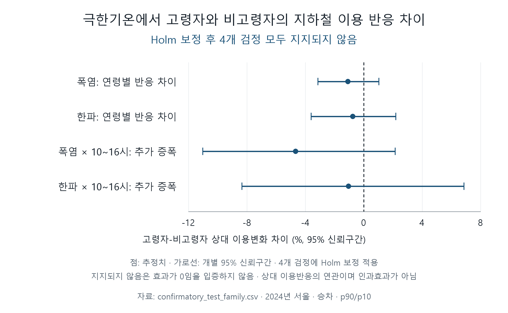
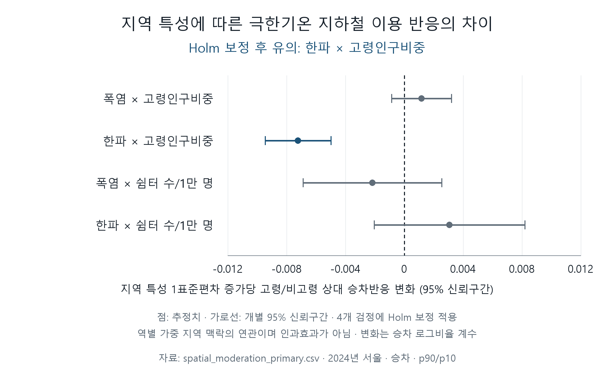

# Stage 4: 지하철 분석 근거 종합과 정책 시사점

## 1. 목적과 상태

작성일: 2026-10-07. 기준 `origin/dev`: `8ed2a52a450d7cb459b3c23ca7c3d36bcf17b9a2` (Stage 3C PR #3 merge). Stage 3A/B/C는 **인간 승인 완료(HUMAN APPROVED)**인 동결 근거다. 이 문서는 5쪽 내외 팀 보고서에 사용할 subway 근거 종합·정책 번역의 기준 기록이다. **Stage 4 HUMAN REVIEW PASS — 2026-10-07**. 최종 Stage 4 종합과 한국어 보고용 보정의 인간 정밀검토가 완료됐다. 팀 수준 공공자전거 통합과 최종 5쪽 보고서는 후속 작업이다.

새 통계분석·모형 변경·기준 결과 또는 영문 그림 재생성은 수행하지 않는다. 별도 한국어 보고용 그림만 승인 CSV에서 렌더링한다. 기존 방법론을 재채택하거나 새 변수·기준값·민감도 분석을 도입하는 단계가 아니다. 지하철 결과만으로 팀 전체의 이동선택권 격차를 확정하지 않는다.

## 2. 동결 근거 입력

| 입력 | 승인 근거와 사용 범위 |
|---|---|
| [Stage 3A 집중 탐색분석](08-focused-eda.md) | 시간대·요일 및 계절 구조·과산포·역 이질성의 기술적 근거. 승인 기록은 [보고서 근거 지도](00-report-map.md)의 P-S3B 사양 동결 기록 및 [AI 사용 기록](ai-usage-log.md)의 P-S3B-SPEC에 있음 |
| [Stage 3B H1/H2](10-confirmatory-h1-h2.md), [주요 결과 CSV](../../results/models/confirmatory_test_family.csv) | 서울 전체 연령별 상대 승차반응과 주간 추가 증폭; 4개 검정 Holm 보정, 사전 동결 사양에서 지지되지 않음 (NOT SUPPORTED) |
| [Stage 3C 근거](11-spatial-heterogeneity.md), [주요 결과 CSV](../../results/models/spatial_moderation_primary.csv) | 역별 기술적 점추정과 역별 가중 지역 맥락의 조절연관; 후속 인간 승인 기록이 현재 상태 |
| [Stage 3C 민감도 CSV](../../results/models/spatial_moderation_sensitivity.csv), [요약 JSON](../../results/models/spatial_moderation_summary.json) | 네 점추정과 원시 공분산 실패 근거 보존; 전체 추론 불가 (NOT ESTIMABLE) |

분석은 2024 서울 243역·366일에 한정된다. Stage 3C는 역이 위치한 173동의 문맥을 사용하며 서울 전체 426동의 대표표본으로 해석하지 않는다. 양쪽 연령집단의 공통 유효 승차 셀은 1,778,759, 역-일 수는 88,938이다. `2024-04-20 / 올림픽공원(한국체대) / 21–22 / senior 187 > total 106` 셀은 원값을 보존하고 양쪽 연령 비교 집계에서 공통 제외했다.

주요 분석의 폭염일은 일최고기온 ≥32.75°C(p90), 한파일은 일최저기온 ≤−3.05°C(p10)로 각각 37일이다. 이는 경험분포 기반 연구용 극한일이며 공식 기상특보 기준이 아니다. 주간 시간대는 사전 지정 `10:00 ≤ time < 16:00`, `10_11`~`15_16` 여섯 시간 구간이다. 주요 분석은 승차를 대상으로 한다. 출처·전처리·공간 가정·시점 한계는 [데이터 출처 목록](../../data_manifest.csv), [Stage 2 기준 기록](../../../docs/subway/2024-clean-transform-baseline.md), 각 Stage 근거를 따른다.

Stage 3C는 `d24830a…`에서 재구축한 `f5e0328…`의 결과이며, `5520e8e…`에서 인간 승인을 기록하고 현재 dev에 병합됐다. `f002cc1`을 복구한 것이 아니고 역사적 29 PASS를 검증 근거로 사용하지 않는다. 기존 문서·생성 요약의 검토 대기(PENDING)은 실행 당시 이력이며 후속 인간 승인과 구분한다.

## 3. 근거 종합표

| 질문/근거 | 확인된 결과 | 판단과 해석 범위 |
|---|---|---|
| Stage 3A: 고령층의 연간 시간대 구조 | 10–16 이용 비중은 고령층 약 48.7%(승차)/49.1%(하차), 비고령층 약 27.7%/29.1% | 기술적 시간대 차이. 극한기온 효과나 이동목적의 증거가 아님 |
| Stage 3B H1: 폭염·한파의 연령별 반응 차이 | H1 두 검정 모두 Holm 비기각 | 동결 사양에서 지지되지 않음 (NOT SUPPORTED). 차이 없음의 증명이 아님 |
| Stage 3B H2: 폭염·한파의 주간 추가 증폭 | H2 두 검정 모두 Holm 비기각; H1/H2 검정군 기각 0/4 | 사전 지정 주간 추가 증폭 지지되지 않음 (NOT SUPPORTED). 연간 주간 집중과 구분 |
| Stage 3C Layer A | 폭염 계수 중앙값 ≈−0.00478341, 한파 계수 중앙값 ≈−0.00961033; 음의 점추정 비중 약 61.7%/71.6% | 역별 기술적 점추정 분포만. 유의한 역 비율·위험/취약 역 분류가 아님 |
| Stage 3C 주요 분석: 고령인구비중 | 한파만 Holm 보정 후 유의, 폭염 비기각 | 한파일의 연령 상대반응과 지역 인구 문맥 사이 음의 조절 연관 |
| Stage 3C 주요 분석: 쉼터 수/1만 명 | 폭염·한파 모두 Holm 비기각 | 현재 지표·사양에서 지지되지 않음 (NOT SUPPORTED). 쉼터 무효과·부족 원인 또는 증설 효과의 증명이 아님 |
| Stage 3C p95/p05 | 대상 분산 4개 중 3개 음수; 네 점추정 보존, 전체 표준오차·신뢰구간·원 p·보정 p·유의성 모두 결측(NA) | 추론 불가 (NOT ESTIMABLE). 비유의성 또는 강건성 근거로 사용 불가 |

Stage 3B는 서울 전체 일별 PPML·날짜 군집 추론이고 Stage 3C 주요 분석은 역-일 `log(senior/non_senior)` 결과변수의 역·날짜 고정효과와 행정동·날짜 이원 군집 공분산을 사용한다. 두 분석은 추정 대상이 다르므로 서울 전체 결과의 비지지와 공간 조절 연관을 모순이나 같은 효과의 재검정으로 표현하지 않는다. 각각의 주요 네 검정에 Holm을 적용했으며 두 검정군을 합친 새 보정을 수행하지 않았다.

아래 수치는 [Stage 3C 주요 결과 CSV](../../results/models/spatial_moderation_primary.csv)의 값을 소수점 여섯 자리로 반올림한 보고용 표다. 지역 특성 변수는 역이 위치한 173개 고유 동의 표본 표준편차로 표준화했다. 신뢰구간은 **개별 95% 신뢰구간(pointwise CI)**이며 Holm 보정 동시 신뢰구간이 아니다.

| 조절연관 (지역 특성 1표준편차당) | 계수 β | 개별 95% 신뢰구간 | Holm 판단 |
|---|---:|---|---|
| 폭염 × 고령인구비중 | +0.001172 | [−0.000869, +0.003214] | 비기각 |
| 한파 × 고령인구비중 | −0.007220 | [−0.009456, −0.004985] | 기각 |
| 폭염 × 쉼터 수/1만 명 | −0.002166 | [−0.006880, +0.002549] | 비기각 |
| 한파 × 쉼터 수/1만 명 | +0.003076 | [−0.002051, +0.008202] | 비기각 |

한파 × 고령인구비중의 원본 계수 β는 `-0.007220386633954651`, Holm p는 `9.777353323110831e-10`이다. 이는 고령인구비중이 한 표준편차 높은 동에 위치한 역에서 한파일의 고령/비고령 승차 로그비율 상대반응이 더 음의 방향이라는 역별 가중 문맥적 연관이다. 고령자 절대 이용량 감소나 거주자 개인의 반응을 직접 추정한 값이 아니다.

**민감도 범위:** 추론 불가 (NOT ESTIMABLE)는 Stage 3C p95/p05의 4개 대상 전체 추론을 뜻한다. Stage 3B의 별도 p95/p05 결과에 이 상태를 적용하지 않는다. 실패 사유는 `NOT_ESTIMABLE_INVALID_TWOWAY_COVARIANCE`; 네 번째 양의 대상 분산도 전체 추론 억제에 포함한다. 전체 억제는 과학적 검토 후 인간이 승인한 처리 절차 수정이며 원래 사전 지정 규칙으로 표현하지 않는다. 분산 절댓값·절단·양의 준정부호 보정 또는 대체 공분산은 사용하지 않았다.

## 4. 보고서용 통합 결론과 이동선택권 해석

> 서울 전체 평균에서는 폭염·한파에 따른 고령자와 비고령자의 지하철 이용반응 차이와 10~16시 추가 증폭이 뚜렷하게 지지되지 않았다. 그러나 공간적으로는 고령인구 비중이 높은 지역일수록 한파일의 고령/비고령 상대 승차반응이 더 음의 방향으로 나타나는 문맥적 연관이 확인됐다. 따라서 극한기후 속 고령자의 지하철 이동을 하나의 평균적 행동패턴으로 설명하기보다 지역 맥락에 따른 이동반응의 이질성을 고려할 필요가 있다.

고령층의 연간 주간 이용 비중이 높다는 EDA 관찰은 H2 지지로 이어지지 않았다. 서울 전체 평균의 비지지는 모든 지역의 반응이 같다는 뜻도 아니다. 공간 결과는 지역별 차이에 주목할 근거를 제공하지만, 동일한 개인이나 절대 이동량의 변화를 식별하지 않는다.

> 동일한 도시철도 네트워크가 존재하더라도 극한기후 상황의 실제 이용반응은 지역의 인구구조와 함께 달라질 가능성이 있으며, 이는 기후회복력 있는 이동선택권을 설계할 때 평균값만으로는 충분하지 않을 수 있음을 시사한다.

현재 지하철 자료는 **이동선택권 격차를 직접 증명하지 않는다**. 팀 전체 격차 결론은 추후 공공자전거 근거와 통합한 뒤 인간이 판단한다.

## 5. 근거 강도별 정책 번역

### Tier 1 — 근거가 뒷받침하는 시사점

| 시사점 | 실행 방향 | 근거 범위 |
|---|---|---|
| 서울 전체에 동일한 대응만 적용하면 지역별 차이를 놓칠 수 있음 | 지역 문맥을 고려하는 대응과 모니터링 | 서울 전체 H1/H2 비지지와 한파 × 고령인구비중 조절 연관을 함께 반영 |
| 한파 이동 모니터링에서 지역 연령구조를 고려할 필요 | 고령인구비중을 함께 보는 우선 모니터링 | 지역 인구 문맥과 연령 상대 승차반응의 연관까지 |
| 고령인구비중이 높은 동의 역 주변은 추가 평가의 우선 대상 후보 | 접근성·이동 여건의 추가 평가 | 역별 위험 순위나 검증된 취약지역 지정이 아님; 새로운 기준값을 설정하지 않음 |

이는 정책 검토 방향이며 정책 효과를 검증한 결과가 아니다. 기대 기여는 평균 중심 진단을 보완하는 데 있고, 이용 증가·격차 감소·탄소감축의 크기는 추정하지 않았다.

### Tier 2 — 추가 근거가 필요한 정책 설계 가설

후속 평가 항목은 역까지의 보행 접근, 무장애·수직 이동 접근, 버스 환승 및 첫·마지막 이동구간 접근, 기상으로부터 보호되는 대기·접근 공간, 기후대응 시설의 실제 접근성·운영 조건이다. 각각이 관측된 한파 조절 연관의 원인 또는 완충 요인인지 확인할 필요가 있다는 **평가 제안**이며, 현재 원인으로 관측됐다는 진술이 아니다. 개선 사업의 효과나 우선 사업 순서를 현 결과로 확정하지 않는다.

**쉼터:** 현재 분석의 단순 쉼터 수/1만 명 조절 연관은 폭염·한파 모두 지지되지 않았다. 따라서 쉼터 수 증가를 입증된 해결책으로 제안하지 않는다. 후속 연구에서는 접근성·거리·질·운영시간 등 세부 지표의 필요성을 검토할 수 있지만 현재 모형에 추가하지 않는다. 이는 쉼터 효과가 없다는 결론이 아니다.

## 6. 지지되지 않은 주장과 해석 한계

- H1/H2 비지지를 “연령 차이가 없다” 또는 반대 효과가 입증됐다는 주장으로 바꾸지 않는다.
- 지역 문맥 조절 연관을 기온·인구구조·보행/교통 인프라의 인과효과로 해석하지 않는다.
- 역 이용자의 거주지·개인 행동·절대 이동 위축·이동목적·쉼터 이용 또는 피난 기능을 확인했다고 주장하지 않는다.
- 역별 기술적 점추정으로 유의한 역, 위험 역, 취약 역 또는 교통소외지역을 지정하지 않는다.
- 쉼터 부족이 결과를 초래했다거나 증설이 입증된 해법이라는 주장, 쉼터 무효과 주장 모두 근거 밖이다.
- Stage 3C p95/p05 추론 불가 (NOT ESTIMABLE)를 비유의성이나 주요 분석의 강건성 증거와 혼동하지 않는다.
- 지하철 분석 단독으로 이동선택권 격차·정책 효과·탄소감축·지역 간 격차를 입증하거나 다른 연도·도시로 일반화하지 않는다.

한계는 단일 연도·단일 ASOS 서울 노출, 역별 가중 추정 대상, 미측정 지역 요인, 역 좌표의 승인된 좌표계·시점 안정성 가정, 공간 제외, 쉼터 자료의 시점·완전성, 직선거리와 실제 접근성의 차이, 집계자료의 거주지·목적 미식별이다. 상세 기술 한계는 Stage 2/3 근거에 남기고 본문에는 결과 해석에 필요한 범위만 선택한다.

## 7. 최종 5쪽 보고서의 최소 근거 구성

다음 요약표 하나와 한국어 주요 그림 두 개를 최소 지하철 분석 후보로 선택한다. 이는 팀 보고서 전체 5쪽 안에서 사용할 후보이며 최종 배치·크기는 인간 검토 및 공공자전거 통합 후 결정한다. 전체 기술 로그와 모든 수치표를 본문에 복제하지 않는다.

| 연구질문 | 근거 | 판단 |
|---|---|---|
| 극한기온에서 고령자와 비고령자의 반응이 다른가? | Stage 3B H1 | 지지되지 않음 (NOT SUPPORTED) |
| 10~16시에 차이가 추가로 커지는가? | Stage 3B H2 | 지지되지 않음 (NOT SUPPORTED) |
| 지역 맥락에 따라 반응이 달라지는가? | Stage 3C 주요 분석 (Primary) | 한파 × 고령인구비중 조절연관만 Holm 보정 후 유의 |
| 쉼터 수/1만 명이 반응을 조절하는가? | Stage 3C 주요 분석 (Primary) | 지지되지 않음 (NOT SUPPORTED) |
| p95/p05 민감도에서 유효한 추론이 가능한가? | Stage 3C 민감도 분석 | 추론 불가 (NOT ESTIMABLE) |

지지되지 않음 (NOT SUPPORTED)은 현재 동결 사양에서 통계적 지지가 부족하다는 뜻이며 영효과 입증이 아니다. 추론 불가 (NOT ESTIMABLE)는 유효한 불확실성·유의성 판단을 제공할 수 없다는 뜻이다.

| 우선순위 | 보고용 그림 | 목적 및 보고서 설명 핵심 |
|---|---|---|
| 주요 그림 1 | [한국어 연령별 반응 차이](../../results/report_figures/confirmatory_effects_ko.png) | 서울 전체 H1/H2 상대 추정치와 개별 95% 신뢰구간. 네 검정의 Holm 기각 0/4; 차이 없음의 증명이 아님 |
| 주요 그림 2 | [한국어 지역 특성별 조절연관](../../results/report_figures/spatial_moderation_effects_ko.png) | Stage 3C 네 조절 추정치와 개별 95% 신뢰구간. 한파 × 고령인구비중 조절연관만 Holm 보정 후 유의; 역별 가중 문맥적 연관 |
| 보충 후보 | [역별 기술적 점추정 지도](../../results/figures/station_extreme_heterogeneity.png) | 역별 기술적 점추정 지도; 유의성·위험 분류 없음 |
| 보충 후보 | [지역 문맥 지도](../../results/figures/spatial_context.png) | 426동 지역 문맥 설명; 이용효과나 원인 지도 아님 |
| 보충 후보 | [Stage 3A EDA 그림 목록](08-focused-eda.md#9-산출물) | 연간 시간대·분포 이해가 필요할 때만 추가; 극한기온 효과로 해석하지 않음 |

주요 그림의 개별 신뢰구간과 Holm 판단을 구분해 그림 설명에 명시한다. Stage 3C p95/p05 추론 실패는 표 또는 본문에 남기며 주요 그림을 강건성 증거로 소개하지 않는다. 기존 [영문 H1/H2 그림](../../results/figures/confirmatory_effects.png)과 [영문 공간 조절 그림](../../results/figures/spatial_moderation_effects.png)은 재현성 근거로 보존한다. 정밀 표는 기존 기준 CSV로 연결하고 필요 시 §3의 반올림 표를 사용한다.

한국어 그림은 [보고용 렌더러](../../tools/render_report_figures_ko.py)로 생성한다: `python subway/tools/render_report_figures_ko.py` (Pillow 필요). 설치된 맑은 고딕 → Noto Sans CJK → Apple 계열 한국어 글꼴 순서로 선택하며 없으면 명시적으로 실패한다. 글꼴 파일은 저장소에 포함하지 않는다. CSV의 기존 점추정·개별 95% 신뢰구간을 그대로 읽고, H1/H2는 기존 영문 그림과 동일한 % 표시 변환만 수행한다. 모형 적합·표준오차·신뢰구간·p값 재계산은 없다. PNG에 원본 CSV 경로와 SHA-256을 기록한다. 2400×1480픽셀, 360dpi로 생성했으며 A4 본문 폭 약 170mm 배치를 기준으로 글자 크기·한글·잘림·0선과 구간의 구분을 시각 점검했다. 본문에서 더 작게 배치하면 가독성을 다시 확인한다.

## 8. 결과 후 후속 가설 — 사후 가설·향후 연구 (POST-HOC / FUTURE WORK)

> 고령인구 비중이 높은 지역에서는 한파 상황에서 고령자의 이동이 상대적으로 더 위축되며, 지역별 교통·보행·기후대응 인프라 조건이 이러한 이동 위축을 완충하거나 악화시킬 수 있다.

이 문장은 **결과 이후 제기된 후속 검증 가설**이며 사전 동결 Stage 3 가설이나 현재의 개인 수준·절대 이동 위축 관측 결과가 아니다. 인프라의 완충/악화는 아직 검증하지 않았다.

> 일부 지역에서 지하철이 단순 교통수단을 넘어 기후대응 또는 피난 인프라 역할을 하는가?

이는 추후 연구질문이다. 현재 집계 승차자료는 이 이동목적을 식별할 수 없다.

## 9. AI 사용과 인간 검토 상태

- 인간: Stage 3A/B/C 승인 및 Stage 4 Mission 제공. 후속 인간 과학적 검토는 종합에 중대한 문제가 없다고 판단하고 한국어·보고용 접근성 보정을 요청했다. 최종 Stage 4 종합·한국어 보고용 보정의 과학적 내용·범위·원본 결과 정합성·그림·해석 경계를 독립 정밀검토하고 **Stage 4 HUMAN REVIEW PASS — 2026-10-07**로 승인했다. 인간이 Python 분석이나 렌더링을 독립 재실행했다는 뜻은 아니다. 팀 수준 공공자전거 통합과 최종 5쪽 보고서는 후속 작업이다.
- ChatGPT: 사용자 Mission에 기록된 승인 과학적 종합, 정책 근거 강도·해석 경계·작업 범위 설계. 최종 Stage 4 종합과 한국어 보고용 보정에 대한 인간의 독립 정밀검토 결과는 **Stage 4 HUMAN REVIEW PASS — 2026-10-07**이다.
- Codex: 동결 CSV/JSON·문서 대조, 종합 문서·표·그림 선택과 기록 연결. 이번 보정에서는 기존 CSV만 읽는 한국어 그림 렌더링, 한국어 문구·상대 링크, 원본 바이트 불변과 시각 검증을 수행했다. 새 과학적 분석·외부 문헌 조사·과학적 tests/runner 실행·공공자전거 결과 검토 없음.

최초 작업 지시 원문 참조: 2026-10-07 사용자 첨부 “Mission: Create the Stage 4 subway evidence synthesis and policy-translation record”, attachment ID `868c8da1-a7db-4841-a21f-7520822c254d`. [AI 사용 기록](ai-usage-log.md)에 사용 범위와 승인 상태를 연결한다. 이전 focused17/full195/production exit0는 Stage 3C의 역사적 기술 검증 근거이며 이번에 재실행하거나 인간의 독립 실행으로 기록하지 않는다.

한국어 보정 지시 원문: 2026-10-07 사용자 첨부 “Stage 4 Human Review Correction”, attachment ID `c8b34453-1fb7-4650-9d41-23413f2c55b0`. 통계 결론·원본 모형·CSV/JSON·영문 그림을 변경하지 않는다.

## 10. 공공자전거 분석과의 팀 통합 인터페이스

### 지하철 분석 결과 (Subway finding)

2024 서울 지하철의 동결 Stage 3B 사양에서 극한기온의 서울 전체 연령별 상대 승차반응 차이와 10–16시 추가 증폭은 명확히 지지되지 않았다(Holm 기각 0/4). Stage 3C에서는 고령인구비중이 높은 동에 위치한 역의 한파일 고령/비고령 상대 승차반응이 더 음의 방향인 역별 가중 문맥적 연관만 주요 4개 검정 Holm 보정을 통과했다. 역별 Layer A는 기술적 점추정이며 Stage 3C p95/p05 전체 추론은 불가하다 (NOT ESTIMABLE).

### 지하철 분석이 입증하지 못하는 것 (What subway does NOT establish)

- 개인·거주자 수준 기온 인과효과, 절대 이동 위축 또는 이동목적·쉼터/피난 이용.
- 입증된 취약 역·교통소외지역·직접적인 이동선택권 격차.
- 쉼터 부족 원인·증설 효과, 보행/환승/무장애 인프라 원인, 정책 효과·탄소감축.
- 비지지 결과의 영효과 증명, 추론 불가 민감도의 강건성 증명, 다른 도시·연도 일반화.

### 공공자전거 근거 확인 목록 (What bike evidence would need to contribute)

- 연령별 이용 차이가 실제로 존재하는지와 그 근거·불확실성.
- 인구 정규화 후에도 차이가 유지되는지와 정규화 분모의 타당성.
- 접근성·디지털 이용·장벽 관련 어떤 근거가 실제로 지지되는지.
- 자료·설계가 허용하는 인과 해석 수준과 남은 한계.
- 지하철과 기간·지역·연령·이용 단위의 비교 가능성 및 두 근거가 팀 이동선택권 해석을 어느 범위까지 뒷받침하는지.
